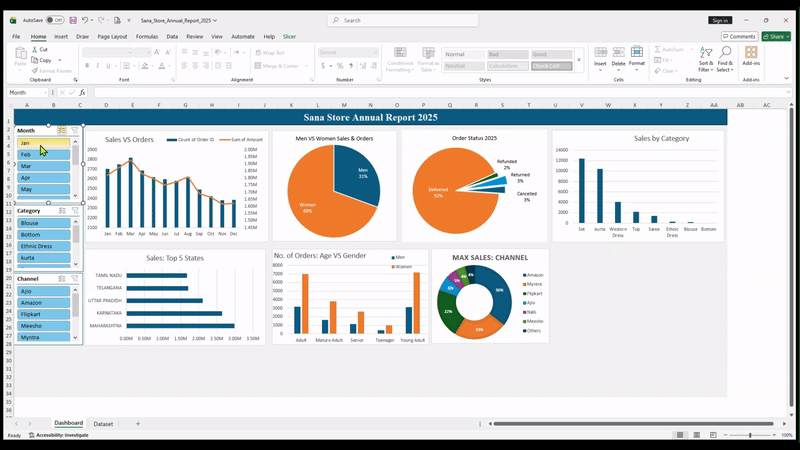

# 📊 Sana Store – Interactive Sales Dashboard (Excel)

## 📌 Project Overview
This project presents an **interactive Excel dashboard** created to analyze the annual sales performance of **Sana Store (2025)**.  
The goal of the project is to transform raw transactional data into meaningful insights that support **data-driven business decisions**.

The dashboard allows users to explore sales trends, customer behavior, product performance, and channel effectiveness using dynamic filters.

---

## 🛠 Tools & Technologies
- Microsoft Excel  
- Pivot Tables & Pivot Charts  
- Slicers for interactivity  
- Data Cleaning & Aggregation  

---

## 📂 Dataset Description
The dataset contains transactional sales records with the following fields:

- Order ID, Customer ID  
- Gender, Age, Age Group  
- Date, Month  
- Order Status  
- Sales Channel  
- SKU, Category, Size  
- Quantity, Amount, Currency  
- Shipping City, State, Country  
- B2B Indicator  

---

## ❓ Business Questions Answered
- How do **sales and orders vary month-wise**?
- Which **month recorded the highest sales and orders**?
- Who purchased more — **men or women**?
- What is the **order status distribution** (Delivered, Cancelled, Returned, Refunded)?
- Which **product categories generate maximum sales**?
- Which **states contribute the most to revenue**?
- What is the relationship between **age group and gender** based on orders?
- Which **sales channel contributes the highest sales**?

---

## 📊 Dashboard Preview

---

## 📈 Key Insights
- Women contribute a **significantly higher share of total sales and orders** compared to men  
- Over **90% of orders are successfully delivered**, indicating strong operational efficiency  
- A few states dominate total sales, highlighting **regional concentration of demand**  
- Certain product categories consistently outperform others  
- Online channels such as **Amazon and Myntra** contribute maximum revenue  
- **Young adults and adults** are the most active customer segments  

---

## 📑 Reports & Visualizations
- Sales vs Orders (Combo Chart)  
- Men vs Women Sales & Orders  
- Order Status Distribution  
- Sales by Product Category  
- Top 5 States by Sales  
- Age Group vs Gender Orders  
- Channel-wise Sales Contribution  

---

## 🎯 Outcome
This dashboard enables stakeholders to:
- Monitor business performance at a glance  
- Identify high-performing products, regions, and channels  
- Understand customer purchasing behavior  
- Support strategic and operational decision-making  

---

## 📎 Files Included
- `Sana_Store_Annual_Report_2025.xlsx` – Interactive Excel dashboard  
- `preview.gif` – Dashboard preview image  

---

## 👤 Author
**Adeel**  
Aspiring Data Analyst | Excel | SQL | Power BI  

🔗 LinkedIn: *https://www.linkedin.com/in/muhammad-adeel-analyst/*  
🔗 GitHub: *https://github.com/adeel-data/Excel-Interactive-Sales-Dashboard*  

---

## ⭐ If you like this project
Give it a ⭐ and feel free to connect!

